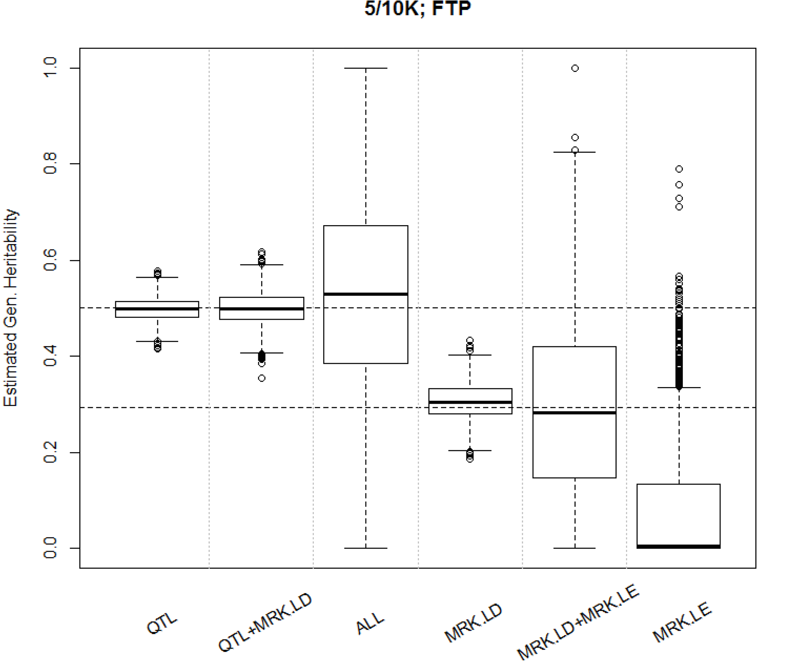
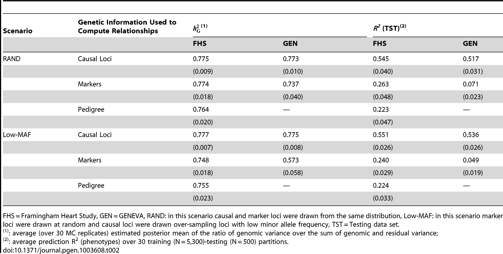

```{r setup, include=FALSE}
knitr::opts_chunk$set(echo = FALSE)
```

## Learning Objectives

- Understanding heritability
- Quantify relatedness
    - Identity by descent (IBD) and Identity by state (IBS)
    - Pedigree-based approach (brief): A matrix 
    - Marker-based approach: G matrix
- Estimating genetic variances via the "Animal" model (brief)
- Cautionary tale of genomic heritability

## What is heritability?

## What is heritability?

- Proportion of total phenotypic variance in a population explained by total genetic ($H^2$) or additive genetic effects ($h^2$)
$$Y = G + E$$
 - In the broad sense:
    $$ V_Y = V_A + V_D + V_I + V_E $$
    $$ H^2 = \frac{V_A + V_D + V_I}{V_A + V_D + V_I + V_E} $$
- In the narrow sense:    
    $$ h^2 = \frac{V_A}{V_A + V_D + V_I + V_E} $$

## Genetic values (a)
- Genetic values (a) are a linear function of allele content at **QTL** 
$$y = a + e = \alpha'z_i + e$$
- Thus $a = \alpha'z_i$, where $\alpha'$ is a vector of additive effects at QTL and $z'$ is a vector of genotypes at each QTL 
 <!---
 The true additive genetic value for an individual is the summation of QTL effects for its genotype. This is often unknown, so we can approximate it with markers
 --->
 
- $h^2$ is the proportion of phenotypic variation that can be explained by a regression of phenotypes on QTL

## Genomic values (g)
- Genomic values (g) are a linear function of allele content at **markers**

- Thus $g = \beta'x_i$, where $\beta'$ is a vector of additive effects at markers and $x'$ is a vector of genotypes at each marker

- Genomic heritability ($h_g^2$) is the proportion of phenotypic variation that can be explained by a regression of phenotypes on markers

## Relationship between $h^2$ and $h_g^2$
- Inferred genetic values ($g$) are only an approximation of true genetic values ($a$)
$$\alpha'z_i = \beta'x_i + e$$
$$a = g + \bar{g}$$

- The true genetic value ($a$) is the genomic value ($g$) plus some genetic effects ($\bar g$) that cannot be captured by markers 
    - $\bar g$ is the 'missing heritability'
    
    - The true $a$ is unknown, but is best approximated via **large pedigrees**


## 'missing heritability'
- Dependant on how well markers capture QTL (e.g. LD between markers and QTL)

- Genomic heritability is $h_g^2 = \rho^2_{zx} h^2$, where $h^2$ is the 'true' heritability, $\rho_{zx}$ is the correlation between QTL and marker (Gianola et al, 2015)

    - Thus, 'missing heritability' $h_{\hat{g}}^2 = (1 - \rho^2_{zx}) h^2$

## Estimating $h^2$ from genetic relatedness via pedigrees

- Rationale: Phenotypic similarity is due to QTL that are shared between related individuals

    - Utilize geneologial data to calculate the expected genetic resemblance between relatives

- **Coefficient of ancestry (kinship coefficient)**: What is the \textcolor{red}{probability} that two alleles at the same locus sampled at random from two individuals are derived from a common ancestor (e.g. are Identical By Descent, IBD)

    - Two randomly sampled alleles at a locus are IBD if they have the same ancestral origin.
    
\begin{center}

\includegraphics[width=125px]{family-similarities}

\end{center}

## Estimating genetic relatedness via pedigrees: expected relatedness

- The expected relatedness between individuals is twice the kinship coefficient

    - This expected relatedness matrix (A-matrix) represents the expected additive genetic relationships between individuals in a population

## Marker-based approach

- **Goal**: Derive a relationship matrix, like $\bf A$, that represents the **realized** genetic similarities between individuals using genetic markers
    - Genomic realtionship matrix ($\bf G$)

1. Determine the proportion of chromosome segments shared via the **identical by state (IBS)** matching of marker alleles.
2. Scale markers to more closely reflect **IBD** relationships

## Tiny GRM example
- ${\bf M}$: $n x m$ matrix of markers (aa = 0, Aa = 1, AA = 2)
```{r, echo = F}
M <- matrix(c(0,1,0,2,
              2,1,1,1,
              2,0,0,0), 3, 4, byrow = T)

print(M)
```  
- ${\bf W}$: subtract 1 to rescale ${\bf M}$ to -1, 0, 1
```{r, echo = F}
M <- matrix(c(0,1,0,2,
              2,1,1,1,
              2,0,0,0), 3, 4, byrow = T)

print(M-1)
```  
## Tiny GRM example: **identical by state (IBS)** matching of marker alleles
- Determine the homozygous identity in state matching by taking cross product (${\bf WW'}$)
    - Diagonal = # of homozygous loci in each individual
    - Off-diagonal = (# of loci with matching homozygous genotypes) - (# number non-matching homozygous loci)
```{r, echo = F}
M <- matrix(c(0,1,0,2,
              2,1,1,1,
              2,0,0,0), 3, 4, byrow = T)

print((M-1) %*% t(M-1))
```     

- \textcolor{red}{${\bf WW'}$ is an $n x n$ {\bf IBS} similarity matrix}


## Marker-based approach: Rescale to reflect **identical by state (IBD)**
- In the previous example common and rare alleles have the same weight on genomic relatedness between individuals
- If two individuals share a rare allele there should be a greater chance that they are closely related
    - Therefore for each marker $i$ in ${\bf M}$, center the marker scores by the mean marker score ($2 \hat{p_i}$) where $p_i$ is the minor allele frequency (MAF) of marker $i$

## Marker-based approach: Rescale to reflect **identical by state (IBD)**
- Suppose the four markers have a MAFs of 0.01, 0.15, 0.25, and 0.5. Subtracting ($2 \hat{p_i}$) from ${\bf M}$ will give us ${\bf Z}$
- ${\bf ZZ'}$
```{r, echo = F}
M <- matrix(c(0,1,0,2,
              2,1,1,1,
              2,0,0,0), 3, 4, byrow = T)

maf <- matrix(c(rep(c(0.01, 0.15, 0.25, 0.5), 3) ), 
              3, 4, byrow = T)

Z <- M - 2*maf
print(Z %*% t(Z))
```     

- ${\bf WW'}$
```{r, echo = F}
M <- matrix(c(0,1,0,2,
              2,1,1,1,
              2,0,0,0), 3, 4, byrow = T)

maf <- matrix(c(rep(c(0.01, 0.15, 0.25, 0.5), 3) ), 
              3, 4, byrow = T)

print((M-1) %*% t(M-1))
``` 

- Individuals 2 and 3 share the rare allele

## Marker-based approach: scale ${\bf G}$ so that it is analogous to ${\bf A}$
-  As the number of markers in ${\bf Z}$ increases, so does the elements of ${\bf ZZ'}$
    - To be comparable we must make ${\bf ZZ'}$ independant of the number of markers
    - Dividing by the sum of variances at each locus $2\sum_{1}^{i}p_i(1-pi)$ gives us ${\bf G}$ a **realized** relationship matrix that has the similar properties to ${\bf A}$
    
    $$\mathbf{G} = \frac{\mathbf{ZZ'}}{2\sum_{1}^{i}p_i(1-pi)}$$
```{r, echo = F}
M <- matrix(c(0,1,0,2,
              2,1,1,1,
              2,0,0,0), 3, 4, byrow = T)

maf <- c(0.01, 0.15, 0.25, 0.5)

Z <- M - 2*maf
sumvar <- 2*sum(maf*(1-maf))
print((Z %*% t(Z)) / sumvar)
```  
    
## Properties of the genomic relationship matrix ${\bf G}$
- Elements of ${\bf G}$ are twice the realized kinship coefficients
- Diagonal elements indicate the degree of inbreeding for individuals ($E(\Theta_{ii}) = 1 + F_{i}$, where $F_{i}$ is the inbreeding coefficient)
    - 1 for non-inbred individuals
```{r, echo = F}
M <- matrix(c(0,1,0,2,
              2,1,1,1,
              2,0,0,0), 3, 4, byrow = T)

maf <- c(0.01, 0.15, 0.25, 0.5)

Z <- M - 2*maf
sumvar <- 2*sum(maf*(1-maf))
print((Z %*% t(Z)) / sumvar)
```

## Estimating genetic parameters with $\mathbf{G}$ via the "Animal" model

$$\mathbf{y} = \mathbf{X\boldsymbol{\beta}} + \mathbf{Zu} + e$$

- $\mathbf{y}$ ($n \times 1$) vector of observations

- $\boldsymbol{\beta}$ ($p \times 1$) vector of fixed effects (year, location, etc.)

- $\mathbf{u}$ ($q \times 1$) vector of genetic values
    - $q$ is all the individuals in $\mathbf{G}$, $q > n$
    - $\mathbf{u} \sim N(0, \mathbf{G}\sigma_g^2$), \textcolor{red}{covariance in genetic values follows from genetic covariance between individuals}

-  $e$ residual effects 
    - $e \sim N(0, \mathbf{I}_n \sigma_e^2)$

## Estimating genetic parameters with $\mathbf{G}$ via the "Animal" model

\begin{align}
\begin{bmatrix}
\mathbf{X'X}  & \mathbf{X'Z} \\
\mathbf{Z'X}  & \mathbf{Z'Z} + \lambda \mathbf{G^{-1}} \\
\end{bmatrix} 
\begin{bmatrix}
\boldsymbol{\hat\beta} \\
\boldsymbol{\hat u} \\
\end{bmatrix}
=
\begin{bmatrix}
\boldsymbol{X'y} \\
\boldsymbol{Z'y} 
\end{bmatrix}
\end{align}

\begin{align}
\lambda = \frac{\sigma_e^2}{\sigma_g^2} = \frac{1 -h^2}{h^2}
\end{align}

## Estimating genetic parameters with $\mathbf{G}$ via the "Animal" model
- Use maximum likelihood (ML) or restricted maximum likelihood (REML) to solve model
    - Goal is to find a set of parameters that maximizes the likelihood of the data
    - ML: Estimates all parameters together; assumes no error in estimating fixed effects
    - REML: Allows for loss of degrees of freedom for estimating fixed effects
    
- Little difference between ML or REML if # of fixed effects is small

- No need to solve it by hand!
    - standalone: ASREML, GCTA, BLUPF90, Wombat
    - R: 'ASREML-R', 'rrBLUP', 'bWGR', 'BGLR'

## REML algorithms
- Some terminology... 

    - Score function: derivitive of the log-likelihood; expected value = 0
    - Information: variance of score function

- Newton-Raphson: Iterative procedure based on second-order Taylor series approximation of LL 

    - $\theta \cong \widetilde{\theta } - \left [ H(\widetilde{\Theta }) \right ]^{-1} s(\widetilde{\theta})$, where $s(\widetilde{\theta})$ is the score function, $\left [ H(\widetilde{\Theta }) \right ]^{-1}$ is the Hessian matrix, $\widetilde{\theta }$ is the current estimate for some parameter, and $\theta$ is the updated parameter
    
    - At each iteration take a current estimate for parameter and use it to update score function and Hessian matrix

## REML algorithms

- Fisher's scoring: replaces the Hessian matrix in NR with the information matrix $\theta \cong \widetilde{\theta }     - \left [ I(\widetilde{\Theta }) \right ]^{-1} s(\widetilde{\theta})$, where $s(\widetilde{\theta})$ is the score function and $\left [ H(\widetilde{\Theta }) \right ]^{-1}$

- AI-REML (Average-information REML): Use an average of the observed and expected information matrices rather than expected information matrix in the Fisher's score algorithm; more computationally efficient
    - Gilmour et al (1995)

## REML algorithms
   
- EM-REML (expectation-maximization REML): If values of random effects are known, variances can be directly estimated from them via $\sigma^2_i = \frac{\textrm{E} \left [ u'_i u_i \right ]}{n_i}$ and $\sigma^2_e = \frac{\textrm{E} \left [ e'_i e_i \right ]}{n}$, where $n$ is the number of elements for $u$ or $e$
    - Iterative approach where each iteration consists of two steps (1) calculate conditional expected values for parameters of distribution, (2) reestimation of parameters by maximization of the expected log-likelihood of the data; repeat until convergence is achieved
    - May take many iterations to converge
    
<!---
the expectation maximization algorithm computes probabilities for each possible completion of the missing data, using the current parameters theta^(t). These probabilities are used to create a weighted training set consisting of all possible completions of the data. Finally, a modified version of maximum likelihood estimation that deals with weighted training examples provides new parameter estimates, theta^(t+1). By using weighted training examples rather than choosing the single best completion, the expectation maximization algorithm accounts for the confidence of the model in each completion of the data.
--->

<!---
Fisher's score: is the first derivative of the likelihood function. Set it to zero and solve to get the max likelihood estimator. the expectation maximization algorithm computes probabilities for each possible completion of the missing data, using the current parameters theta^(t). These probabilities are used to create a weighted training set consisting of all possible completions of the data. Finally, a modified version of maximum likelihood estimation that deals with weighted training examples provides new parameter estimates, theta^(t+1). By using weighted training examples rather than choosing the single best completion, the expectation maximization algorithm accounts for the confidence of the model in each completion of the data.
--->

## Alternative methods (Baysian Gibbs sampling approach)
- Gibbs sampling generates random drawings from marginal posterior distributions through iterative sampling from the conditional posterior distributions

    - From the animal model ($\mathbf{y} = \mathbf{X\boldsymbol{\beta}} + \mathbf{Zu} + e$) we have a vector of parameters ($\beta$, $\mathbf{u}$, $\sigma^2_u$, and $\sigma_e^2$) and a conditional distribution that generates the data ($\mathbf{y}| \beta, \mathbf{u}, \sigma^2_e \sim N(\mathbf{Xb} + \mathbf{Zu} + \mathbf{R} \sigma_e^2$)
    
    -Process:
        **1.** Choose priors ( $\beta$ -> flat $P(b) \sim \textrm{constant}$; $u|G, \sigma_u^2 ~ N(0, \mathbf{G} \sigma_u^2)$; scaled inverted chi-square distributions for variance components
        **2.** For each parameter calculate the full conditional posterior distribution assuming all other parameters are known, sample from this distribution
        **3.** Rerun (2) using updated values, repeat until convergence 
    
    
## A cautionary tale of genomic heritability

- Is genomic heritability a good approximation of $h^2$?

- $\mathbf{G} = \frac{\mathbf{ZZ'}}{2\sum_{1}^{i}p_i(1-pi)}$

    - What information is captured with $\bf Z$?
    
## A cautionary tale of genomic heritability

- Is genomic heritability a good approximation of $h^2$?

- $\mathbf{G} = \frac{\mathbf{ZZ'}}{2\sum_{1}^{i}p_i(1-pi)}$
    
    - What information is captured with $\bf Z$?
        
        - QTLs are typed by markers
        
        - Markers in LD with QTL
        
        - Markers in LE with QTL

<!---
The real genetic values depend only on QTL, not additional 'non-pertent' markers
--->

## A cautionary tale of genomic heritability: de los Campos et al (2013)

- Six simulated scenarios for construction of $\bf G$: 1. Only QTL; 2. QTL and markers in LD with QTL; 3. All loci (causal and non-causal); 4. Only markers in LD with QTL; 5. Only markers in LE with QTL (non-informative for $\sigma_p^2$); 6. All markers (LD and LE with QTL)
    - $h^2$ fixed at 0.5

{width=225px}    

<!---
- Scenarios 1-3 expect no missing heriability because QTLs are included

- Scenarios 4-6 expect missing heriability because QTLs not included; 5 is essentially the null model
--->

- \textcolor{red}{Incomplete linkage between causal loci and marker leads to missing heritability. Thus $h^2 \neq h_g^2$}


## A cautionary tale of genomic heritability: de los Campos, Sorrensen, Gianola (2015)

- Comparing $h^2$ and $h_g^2$ in related (FHS) and unrelated populations (GEN)

{width=250px}

- Proportion of allele sharing at markers and QTL are greater for related individuals compared to unrelated individuals

    - \textcolor{red}{Cosegregation of markers and QTL are due to recent relationships}


## Further reading

- de los Campos, G., Vazquez, A. I., Fernando, R., Klimentidis, Y. C. and Sorensen, D. Prediction of complex human traits using the genomic best linear unbiased predictor. PLoS Genet. 9, e1003608 (2013)

- de los Campos, G., Sorensen, D. & Gianola, D. Genomic heritability: what is it? PLoS Genet. 11, e1005048 (2015).
