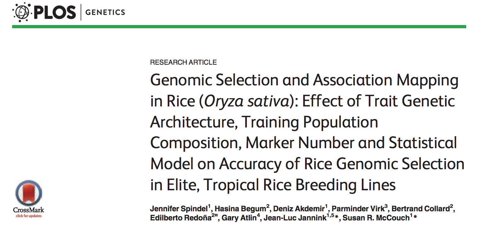

```{r setup, include=FALSE}
knitr::opts_chunk$set(echo = FALSE, size = "footnotesize")
library(rrBLUP)
```


# Learning Objectives

1. Participants will be able to calculate a GRM
	
2. Participants will be able to run gBLUP
	
3. Participants will be able to run rrBLUP
	
4. Participants will be understand the equivalency of gBLUP and rrBLUP

# Outline

A. Demonstration with Spindel data

B. On your own (1) gBLUP and rrBLUP Zhao data set, (2) cross validation

# Spindel data set

- 299 elite rice lines from IRRI 

- genotyped with 73,147 SNPs

    - we'll use 39,560
    
- phenotyped for 19 traits 

    - **grain yield (GY)**
    
    - measured in dry and wet seasons
    
{width=225px}

# Loading data
\footnotesize
```{r load spindel data, echo = T}
##Clear all objects
rm(list = ls())

# Load the data
pheno <- read.csv("~/Downloads/Spindel/pheno_WS.csv")
dim(pheno)

geno <- read.table("~/Downloads/Spindel/Spindel_geno.txt", 
                   sep = "\t", header = T, row.names = 1)
dim(geno)
geno <- t(geno)
dim(geno)

sum(row.names(geno) == pheno$GHID)
```

# Calculate a GRM
\footnotesize
```{r GRM for spindel, echo = T}
head(geno[,1:5])

Zsc <- scale(x = geno, center = T, scale = T)
GRM <- tcrossprod(Zsc)/ncol(geno)

dim(GRM)
```


# gBLUP using rrBLUP package
\footnotesize
```{r gBLUP via rrBLUP, echo = T}
library(rrBLUP)

#MM with rrBLUP regression on G
gBLUP <- mixed.solve(y = pheno$YLD, K = GRM)
names(gBLUP)

length(gBLUP$u)
```


# rrBLUP using rrBLUP package
\footnotesize
```{r rrBLUP via rrBLUP, echo = T}
library(rrBLUP)
Zc <- scale(x = geno, center = T, scale = F)

#MM with rrBLUP regression on markers
rrBLUP <- mixed.solve(y = pheno$YLD, Z = Zc)
names(rrBLUP)

length(rrBLUP$u)
```

# Are rrBLUP and gBLUP equivalent?

- Recall $$\hat g = W \hat a$$ 

- Thus, here we'll leverage that to calculate the breeding values (GEBVs) from the predicted marker effects
\footnotesize
```{r rrBLUP v gBLUP, echo = T}
#calculate GEBVs from predicted marker effects
gBLUP_rr <- Zc %*% rrBLUP$u

gBLUP_YLD <- gBLUP$u + as.numeric(gBLUP$beta)
gBLUP_rr_YLD <- gBLUP_rr + as.numeric(rrBLUP$beta)
```

# Are rrBLUP and gBLUP equivalent?
\footnotesize
```{r rrBLUP v gBLUP plot, echo = T, fig.height=1.7, fig.width=3.2, fig.align="center"}
par(mar=c(3,4,0.5,0.5), mgp=c(1.8,0.5,0), xpd = F, cex.lab = 0.5, 
    cex.axis = 0.5)
plot(gBLUP_YLD, gBLUP_rr_YLD, ylab = "Predicted YLD (RR-BLUP)", 
     xlab = "Predicted YLD (gBLUP)", pch = 21, cex = 0.5)

abline(lm(gBLUP_rr_YLD ~ gBLUP_YLD), col = "red")

text(x = 4400, y = 5200, paste0("r = ", 
  round(cor(gBLUP_YLD, gBLUP_rr_YLD),2)), col = "red", cex = 0.75)
```

# On your own
- Download the Zhao data set and repeat the analysis above

    - https://github.com/malachycampbell/StatisticalMethodsforOmicsAssistedBreeding/gBLUP_rrBLUP/ZhaoData.zip

    - You will have to (1) recode the SNP data, (2) partition and mask the data for cross validation

        - See the examples in the file 'gBLUP_RRBLUP_ex.Rmd'